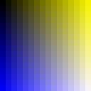
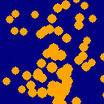
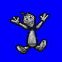

:warning: _This file was converted from the EDGELIB 4.02 documentation from 2012 and is included for historic purposes. The documentation is not maintained anymore: information is outdated and external links might be broken._

# 2D Graphics

## Graphics display
EDGELIB contains a graphics engine to draw 2D and 3D graphics on each device in fullscreen. For desktop and Windows Mobile devices, the display can be shown in a window as well.

EDGELIB 2.20 introduced optional DirectDraw support for Windows Mobile. As of EDGELIB 2.70 the Direct Screen Access API is used for Symbian which doesn't conflict with the window server and increases application stability.

|  |
|:---:|
| Li-Nuggz Smartphone |

The graphics engine draws graphics in the native color depth of the device by default, no color conversion has to be made. Developers can also create surfaces of a custom ('emulated') color depth. Color conversion will be handled automatically when blitting from a surface to another with a different color depth.

The display class supports 8, 12, 15, 16, 24 and 32 bits color depths. EDGELIB also supports Symbian devices with an "18 bit" lcd display, such as the Nokia 6680 phone.

|  |  |  |  |
|:---:|:---:|:---:|:---:|
| 12 bit (444) | 16 bit (565) | 24 bit (888) | 12 bit (444) dithered |

Additionally, EDGELIB supports optional dithering to improve the display of images on displays with low color depths. EDGELIB can apply a dithering algorithm automatically at load-time when opening an image.

It's also possible to emulate another color depth with a simple configuration option. This is useful to see how game graphics will look on devices with a low amount of colors. For example, the N-Gage with 4096 colors.

## Display orientation
Usually, the devices supported by EDGELIB have a display with a portrait layout (the width is smaller than the height). It's possible to configure EDGELIB as if the display was rotated (for example to a landscape layout). No additional effort has to be made, when developing a landscape oriented application with EDGELIB.

EDGELIB supports rotation in all four orientations (0, 90, 180 and 270 degrees). As of EDGELIB 2.50 applications can also inherit the current screen orientation of the operating system. EDGELIB 2.95 added additional orientations to force the display into portrait or landscape mode.

As of EDGELIB 3.20, it's possible to make layout and orientation aware applications. Some devices change their orientation when cover is slided or the display is flipped. You're application can take the new orientation for the best user-friendly experience. Also it's possible to change the orientation at will (hot-rotate). When the orientation is changed, surfaces are rotated automatically.

Below is a screenshot of a game running in landscape mode.

|  |
|:---:|
| Screenshot of a landscape oriented game (320x240) |

## Native high-resolution support
EDGELIB supports high-resolution applications for Windows Mobile and Symbian devices.

Windows Mobile 2003 introduced high-resolution support for devices with high-resolution display hardware. Certain new Pocket PC's, like the Dell Axim x50v, have a VGA resolution screen (480x640 pixels) and certain new Windows Mobile Smartphone models, like the Orange C550, are equipped with a QVGA resolution screen (240x320 pixels).

Symbian 8.1 introduced high-resolution devices such as the Nokia N90 or the Nokia E60. The display is equipped with double resolution in comparison with other Series 60 devices (352x416 pixels). As of Symbian 9, devices can also have a different resolution for example the E61 has a QVGA landscape display (320x240 pixels).

Using EDGELIB, the developer is able to use the high-resolution screens of these devices just by editing a resource file for Windows Mobile, using a Windows Mobile 5+ SDK or using a Symbian 8+ SDK.

Look below to see the difference in quality between low and high resolution devices. Note that the left image is zoomed in to 200%.

|  |  |
|:---:|:---:|
| Low resolution (200%) | High resolution (100%) |

## 2D surfaces
EDGELIB contains a surface oriented graphics engine. This means that the display buffer, and additional resources can be contained in a surface. EDGELIB supports two surface types: a basic surface (RGB) and a surface with an additional alpha channel (RGBA).

The following two samples show a background and foreground image on both an RGB and RGBA surface. The third image shows the PNG image that is used as an RGBA surface.

|  |  |  |
|:---:|:---:|:---:|
| RGB Surface | RGBA Surface | Image with alpha channel |

RGBA surfaces can also be pre-calculated, increasing performance during a blit.

Any surface can also be written to disk as a plain 24 bit Windows bitmap file (BMP) or PNG file for the easy creation of screenshots of your game. 

## Drawing primitives
Using EDGELIB, basic shapes can easily be drawn on a 2D surface. This includes putting pixels, drawing lines, rectangles, ovals and polygons.

Rectangles, ovals and polygons can be filled with a solid color. Rectangles and polygons can also be filled with a gradient with optional dithering. Additional color filters for drawing primitives with special effects are available too.

Below is a picture of shapes which can be drawn by EDGELIB.

|  |
|:---:|
| Drawing primitives |

## Blitting
Surface content can be copied from one surface to another by a method called blitting. Select a rectangle of pixels to copy and blit onto a surface.

There are two types of blits: regular and fast blits. Regular blits can have rotated, scaled and flipped surfaces while blitting, while fast blits cannot. Fast blits are optimized for speed, so it's good practice to use as many fast blits as possible.

A transparency color can be selected with a color key. Additional color filters for blitting surfaces with special effects are available too.

In the following samples a sprite is blitted from the spritesheet (first image) onto a background (second image). A magenta color key is used.

EDGELIB 2.90 introduced blitlets. Using blitlets you can select optimized blitter routines for each color filter combination to speed up blitting-intensive operations. By removing optimized blitter routines not used by the application, the final executable will be smaller.

|  |  |  |
|:---:|:---:|:---:|
| Sample spritesheet | Sample background | Blitted surface |

## Color filters
When blitting surfaces or drawing primitives in EDGELIB-driven applications, a variety of powerful color filters can be applied for special effects. Also all combinations of color filters can be used.

Currently EDGELIB supports the following color filters:
* Color key
* Opacity blending
* Additive alpha blending
* Subtractive alpha blending
* Colorizing
* Tint
* Color fill

     
In the following sample images an additional color key filter (black) is added, except for the first one.

|  |  |  |  |
|:---:|:---:|:---:|:---:|
| No filter | Color key (black) | Opacity 50% | Additive alpha |

|  |  |  |  |
|:---:|:---:|:---:|:---:|
| Subtractive alpha | Colorize (orange) | Tint (orange) | Color fill (orange) |

Use pixel shaders to create custom effects on a per-pixel basis.

## Dynamic clipping
When drawing graphics on a surface, portions of the surface can be clipped. The clipping rectangle can be changed in realtime to exclude parts of the surface for drawing. Each surface has its own clipping rectangle.

In the next sample a portion of a surface is blitted to another surface with a clipped rectangle. The second surface contains a background image.

|  |
|:---:|
| Clipped image |

## Drawing text
Text can be drawn on a surface, by using another surface with font graphics. Fonts can be drawn in fixed width (each character has the same width) or in variable width. A font surface contains 96 characters (32-128) by default but can be expanded by any size.

EDGELIB also offers functionality for horizontal and vertical padding, newlines and font alignment.

The following images show a portion of a fixed width font and a font with a variable width. Notice the white pixels on the first row to indicate the width per character.

As of EDGELIB 2.95, it's also possible to write fonts with automatic text wrapping based on a given width in pixels. Text wrapping can be pre-calculated for fast text drawing.

|  |  |
|:---:|:---:|
| Fixed width font | Variable width font |

## Supported image file formats
To ensure maxium compatibility and robustness EDGELIB is equipped with native image loaders making the engine fully independent from external libraries. Because the image loaders are implemented as plugins, unused image formats can be disabled to decrease the filesize of your executable.

The following popular image formats are supported:
* BMP (Windows bitmap)
* GIF (Graphics Interchange Format)
* PNG (Portable Network Graphics)
* JPEG (Joint Photographic Experts Group) as of EDGELIB 2.90
* TGA (Targa) as of EDGELIB 2.90

A broad range of special types of these images are supported, such as animated GIF's, monochrome and 4-bit BMP bitmaps, interlaced GIF and PNG images, progressive JPEG images and TGA images with an alpha channel.

Surface content is usually loaded from a file or memory. Each image format has its own advantages and disadvantages relating to size, quality and features.

The following sample images show the differences between the image formats:

|  |  |  |  |
|:---:|:---:|:---:|:---:|
| 8 bit BMP | 24 bit BMP | GIF | PNG |

File sizes of the above images are:
* 8 bit BMP: 24,120 bytes
* 24 bit BMP: 69,174 bytes
* GIF: 9,838 bytes
* PNG: 37,135 bytes
* JPEG (lowest quality) 8,483 bytes
* JPEG (highest quality) 23,956 bytes

Note: JPEG does not support transparancy.

## Surface rotation and scaling
An additional blitting method enables the developer to rotate, scale (shrink and enlarge) and flip (horizontal and vertical) any surface real-time (rotating and scaling is also called 'rotozooming'). This can save memory and graphics resources for rotating objects, because you don't need to have an image for every frame.

The following images demonstrate scaling, rotating and flipped blits.

|  |  |  |
|:---:|:---:|:---:|
| Original image | Scale (shrink) | Scale (enlarge) |

|  |  |  |
|:---:|:---:|:---:|
| Rotate | Rotate + scale | Horizontal flip |

## Collision detection
EDGELIB supports two types of collision detection: bounding box and pixel precision, for respectively comparing two rectangles for intersection and comparing two surfaces (with pixel data) for pixel precise collision detection.

Collision can be checked between 2D surfaces, RGBA surfaces or a combination.

Optionally, the point of collision can be retrieved as well. As of EDGELIB 2.60, you can check rectangle intersection and if a point is inside a rectangle.

The following images demonstrate bounding box collision detection:

|  |  |
|:---:|:---:|
| Bounding box collision 1 | Bounding box collision 2 |

The next images demonstrate pixel precise collision detection:

|  |  |
|:---:|:---:|
| Pixel precise collision 1 | Pixel precise collision 2 |

## Built-in screen wipes
EDGELIB contains functionality to wipe one surface to one another with various wipe effects. Some of these wipes can be customized as well. Use a wipe to make transitions between several screens in games.

Currently EDGELIB supports the following wipes:
* Slide (up, right, down or left)
* Blend (crossfade)
* Pixelate (mosaic effect)
* Dissolve (custom screen wipe)
* Tiled animation (customizable)

Below you can see a few examples of wipes between two surfaces:

|  |
|:---:|
| Blend |

|  |
|:---:|
| Pixelate |

|  |
|:---:|
| Screen + dissolve custom data |

## Custom pixel shaders
When a blit effect isn't available in EDGELIB, it's possible to define custom pixel shaders. This enables great customizability, but at the expense of performance. These custom pixel shaders can be used for transparent (colorkeyed) surfaces and non-transparent surfaces.

EDGELIB offers four sample pixel shaders, ready to be used. Look below to see the results when blitting a transparent sprite with several pixel shaders.

|  |  |  |  |
|:---:|:---:|:---:|:---:|
| AND pixel shader | OR pixel shader | XOR pixel shader | Grayscale pixel shader |

## DirectDraw hardware support for Windows
As of EDGELIB 2.20 the engine supports DirectX hardware supported blitting via DirectDraw. This can drastically speed up your applications when taking advantage of the video hardware. This is supported for both Windows Desktop and Windows Mobile 5.0+.

Note that to take full advantage of hardware support you should use a minimum of the advanced EDGELIB internal blitting effects.
