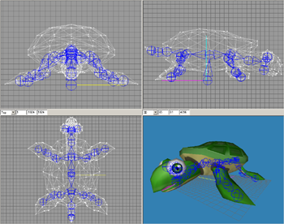

:warning: _This file was converted from the EDGELIB 4.02 documentation from 2012 and is included for historic purposes. The documentation is not maintained anymore: information is outdated and external links might be broken._

# 3D Graphics

## 3D surfaces
3D surfaces are available to store 3D models. Models contain a vertex list that are linked into polygons.

The following render methods are supported: wireframe, solid (no shading, flat shading, Gouraud shading and texture mapping.

Models can be created manually or loaded from 3D Studio Max (.3ds), MilkShape 3D (.ms3d) or EDGELIB 3D (.e3d) files. Even animated 3D models can be read!

Models can be used for both OpenGL ES and EDGELIB's fast internal 3D renderer.

|  |
|:---:|
| 3D surfaces (Model by psionic3d.co.uk) |

## OpenGL ES and OpenGL
As of EDGELIB 3.00 you can use OpenGL ES and OpenGL with the EDGELIB SDK. OpenGL functions are available using a simple plugin mechanism. This enables developers to take advantage of hardware accelerated 3D rendering on devices with advanced graphics cards on board.

OpenGL (ES) also provides the following advanced 3D rendering features:

* Wireframe rendering, flat shading and smooth shading
* Perspective correct texture mapping
* Skeletal animation
* Z-Buffer
* Pixel shading
* World and model transformation
* Dynamic lighting
* Fog

     
The following implementations are currently supported:
* Imagination Technologies PowerVR
* Hybrid Rasteroid
* NVIDIA GoForce (as of EDGELIB 3.20)
* Native Windows implementations

     
Some features may not be available in certain OpenGL implementations or devices.

## Internal 3D renderer
EDGELIB provides an internal platform independent 3D engine when OpenGL (ES) is not available.

The following features are available in the internal 3D engine:

* Wireframe, flat shaded, Gouraud shaded and texture mapped rendering
* Skeletal animation
* Z-Sorting
* World and model transformation
* Render to 2D surfaces for advanced effects
* Up to 8 dynamic light sources

     
The pictures below demonstrate each render method.

|  |  |  |  |  |
|:---:|:---:|:---:|:---:|:---:|
| Wireframe | No shading | Flat shading | Gouraud shading | Texture mapping |

## 3D animations
As of version 3.00 EDGELIB fully supports skeletal animations based on joints and keyframes. Using the MilkShape 3D loader, models containing animation information can be imported and used easily. EDGELIB provides simple functions to animate 3D models based on time.

|  |
|:---:|
| Four frames of an animated turtle 3D model in MilkShape 3D. Model by psionic3d.co.uk |

The EDGELIB animation functions support both translation (movement) and rotation animations and works for both OpenGL ES and the internal 3D renderer.

EDGELIB has a native loader plugin for reading MilkShape 3D models and animations.

|  |
|:---:|
| Turtle 3D model in MilkShape 3D |

## 3D format loaders
EDGELIB is equipped with native 3D model loaders. These are platform independent and don't rely on external libraries. They are based on a plugin mechanism and can be disabled to decrease the file size of your executable.

The following popular model formats are supported:

* 3D Studio (.3ds)
* Milkshape 3D (.ms3d)

Also supported is EDGELIB's internal 3D format (.e3d), which has the following advantages:

* Built for fast and efficient loading
* All data is saved as fixed point
* Can be expanded in new releases without breaking compatibility
* An open documented format which can be used by everyone
* Custom chunks can be added safely for your own custom data

A conversion tool is included in the EDGELIB SDK to convert your models fast and easily.

## 3D helper functions
EDGELIB has a few helper functions to make the life of 3D developers easier.

* Independent interface to access OpenGL (ES) and the internal 3D renderer of EDGELIB
* Easy texture uploading to OpenGL (ES)
* Extended 2D functions to blit 2D surfaces as textures to the display (BltFast, FillRect, DrawFont)
* Functions to easily implement 3D animations
