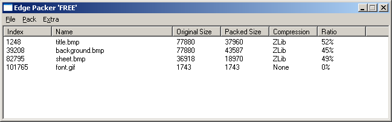

:warning: _This file was converted from the EDGELIB 4.02 documentation from 2012 and is included for historic purposes. The documentation is not maintained anymore: information is outdated and external links might be broken._

# File handling

## File reading and writing
The file module is provided for a generic interface to file systems across different devices. Files can be opened, closed, created, read and written.

Writing a file can be useful for storing game data like options, a list of the highest scores and saved games.

Besides reading and writing, it's also possible to delete and rename files.

## Folder manipulation
The contents of a file folder (directory) can be read by opening them using the file module. This can be used to retrieve a list of files that is present in a specific folder. You can apply a file filter to retrieve a result set of just a specific file extension.

Folders can also be created, renamed and deleted. Only empty folders containing no files can be deleted.

As of EDGELIB 2.50 developers can set and retrieve the current working directory to open and write files more easily using relative paths, even if the operating system only supports absolute paths.

## Resource packs
The file module is able to create, write and read cross-platform EDGELIB package files. These package files contain a list of resource files that can be compressed using various methods. This is useful for reducing and grouping game data.

Files can be compressed using Zlib (G-Zip) or an internal Edge compression algorithm. Additionally, compression can be disabled.

The EDGELIB Packer tool is included in the EDGELIB SDK and offers advanced GUI and commandline interfaces to manipulate EDGELIB packages.

|  |
|:---:|
| EDGELIB Packer tool |

The file tutorial contains a page about EDGELIB package files.

## INI files
EDGELIB 2.50 introduced a generic, file based INI (initialization) class. INI files consist of lines containing key-value pairs and can be used to read and write game data like saved games, highscores and configuration settings.

Functions for writing comments and searching for keys and values was added in the EDGELIB 2.60 release.
