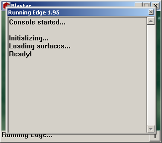
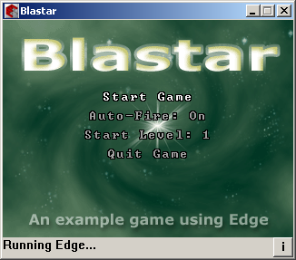
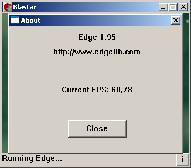

:warning: _This file was converted from the EDGELIB 4.02 documentation from 2012 and is included for historic purposes. The documentation is not maintained anymore: information is outdated and external links might be broken._

# Miscellaneous

## Standard class
EDGELIB features a standard class of platform independent functions for a variety of useful string operations like conversions from and to integer, generating MD5 hashes, changing characters to their uppercase equivalents, convert timestamps between datetime structure values, etc.

All functions support multibyte (char *) strings and wide character (WCHAR *, unicode) strings.

## String class
EDGELIB 3.30 introduced a new string class which makes it easier to handle string variables and string processing. The string class is platform independent and can be used on all platforms.

A great advantage of string classes is that it's now possible to concatenate string easily by just adding them and not using time consuming string copy procedures. String classes are also more stable by making sure it doesn't read or write to illegal memory addresses.

## Timer class
EDGELIB uses an internal timer to keep track of the game speed. A timer value is provided within the game loop which can be used for device independent animations. The timer module can also be used to read the amount of ticks that has passed from system startup. Virtual timers can be used for smooth timer speed-ups or slowing down.

EDGELIB offers classes for realtime and virtual timers.

## Math class
The math module can be used for retrieving fixed point sine/cosine values. These math functions are faster because no floating point math is used. When using EDGELIB, you no longer need to create a lookup table for these functions. The math class also contains a quick random number generator.

Also functions to retrieve the integer square roots of values and to convert float values to fixed point values are available. EDGELIB 3.00 introduced fixed point matrix math for use in your (3D) application.

## Device information
EDGELIB can be used to retrieve information about the device, that can be important for device specific data (like dynamic registration).

The following information can be read from the device:

* Device ID (owner name on Windows Mobile, IMEI number on Symbian, GP2X serial number)
* Model and brand names
* The running operating system

## Debugging tools
Several debug tools are available for the developer to use while the application is running.

The logging console, available for Windows desktop development, can be used to dump lines of text to a separate window. This can be very useful when you have no screen font loaded. The logging console is turned on by default but can be turned off by changing the EDGELIB configuration.

It's also possible to log lines of text through the EDGELIB framework. Logging will be written to a file named log.txt in the same folder as the program executable. This feature is available for all supported platforms.

Other debug features are the status bar (containing a line of text) and the EDGELIB information dialog. These are only available for Windows desktop.

|  |  |  |
|:---:|:---:|:---:|
| Logging console | Status bar | Information dialog |

## Event recording
EDGELIB 2.95 added new functionality to the framework for recording events.

This feature makes it possible to start recording time and input events and save them to a file. This file can be played back later to exactly replicate the application behaviour during the recording phase. This can be useful to reproduce bugs easier if the bug happened in the previous recording.

## EDGELIB Builder tool
The EDGELIB Builder tool (formerly Edge IDE) provides a quick way for building projects for various platforms supported by EDGELIB. Create and build projects within a minute and run it on your target mobile device.

Using the EDGELIB Builder tool has the following advantages:

* Quickly create and rename projects
* Great flexibility
* Plugin based builder, it's possible to add new platforms through ini files
* Possibility to build on network drives and drives other than the installation folder of the device platform SDK
* Easy icon generation, able to convert common image files (Bitmap, GIF and PNG) to program icons
* Built-in Symbian installation (.sis) file creator
* Build for all supported platforms with a single command
* Smart UID management for Symbian builds
* Enable Windows Mobile VGA and Symbian capabilities through a user-friendly interface
* All project and program setting files are editable ini files
* Build projects through the commandline

The following platforms are supported:

* Symbian Series 60 first and third editions
* Symbian Series 80 first and second edition
* Symbian Series 90
* Symbian UIQ 2.1 and UIQ 3.0
* Windows Mobile 2002, 2003, 2005 and 2006
* GP2X
* Gizmondo
* Windows Desktop using Visual C++ 6.0 or Visual Studio 2005.

We recommend using Microsoft Visual Studio for developing and debugging the game on your desktop, and use the EDGELIB Builder tool to create mobile device builds.
