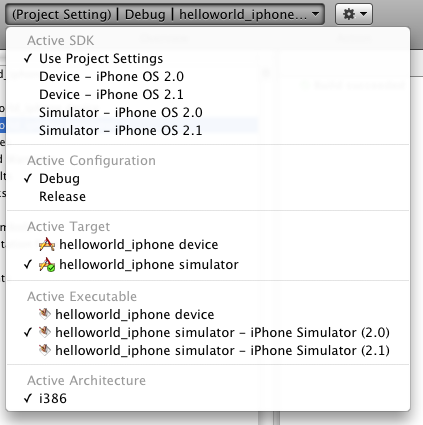

:warning: _This file was converted from the EDGELIB 4.02 documentation from 2012 and is included for historic purposes. The documentation is not maintained anymore: information is outdated and external links might be broken._

# Creating an EDGELIB project

## Creating a new project
Start XCode and create a new project. Choose 'Window-Based application' and click on choose (make sure the iPhone platform is selected). Name your project 'Helloworld' and click on save. Now the project must be modified a bit. First remove all existing source files with the .m and .h extension. Also remove the MainWindow.xib file. Edit the info.plist file and remove the line: "Main nib file base name" (select the line and press delete).

## Bundle identifier
In the info.plist file there is also a 'bundle identifier' setting. This must be defined when building for an iPhone device. It consists of a vendor ID and an application ID. Request them on the iPhone developer center after becoming a registered iPhone developer. For this tutorial you can keep the default setting.

## Adding a C++ source file containing the application framework
Inside XCode, first create a new source file by right clicking on the classes folder in the "Groups & Files" list on the left. The select add > new file. A new screen pops up with options for your new file. Select 'C and C++' from the left selection box then choose 'C++ File' on the right and click next. Name it helloworld.cpp (untick the 'also create helloworld.h' checkbox). Click on finish to open it in the editor. Paste the following code:

_helloworld.cpp (65 lines)_
```c++
/////////////////////////////////////////////////////////////////////
// Code/helloworld.cpp
// One of the EDGELIB tutorial samples for iPhone
//
// Copyright (c) 2008-2017 Elements Interactive B.V.
// http://www.edgelib.com
//
// Show "hello world" on the screen and exit by tapping the screen
/////////////////////////////////////////////////////////////////////
 
/////////////////////////////////////////////////////////////////////
// Include and link the library                                    //
/////////////////////////////////////////////////////////////////////
 
//Include EDGELIB
#include "edgemain.h"
 
/////////////////////////////////////////////////////////////////////
// Class definition                                                //
/////////////////////////////////////////////////////////////////////
 
//The main class
class ClassMain : public ClassEdge
{
    public:
        ClassMain(void);
        ~ClassMain(void);
        ERESULT OnNextFrame(ClassEDisplay *display, unsigned long timedelta);
        void OnStylusDown(POINT pnt);
};
 
 
/////////////////////////////////////////////////////////////////////
// ClassMain: public                                               //
/////////////////////////////////////////////////////////////////////
 
//ClassMain: constructor
ClassMain::ClassMain(void)
{
}
 
//ClassMain: destructor
ClassMain::~ClassMain(void)
{
}
 
//Callback: Called every frame
ERESULT ClassMain::OnNextFrame(ClassEDisplay *display, unsigned long timedelta)
{
    display->buffer.DrawFont(0, 0, &display->fontinternal, "Hello World!");
    return(E_OK);
}
 
//Callback: Called when the user points the stylus down or clicks the left mouse button
void ClassMain::OnStylusDown(POINT pnt)
{
    Quit();
}
 
 
/////////////////////////////////////////////////////////////////////
// The program entry point                                         //
/////////////////////////////////////////////////////////////////////
 
ClassEdge *EdgeMain(EDGESTARTUP *data){ return(new ClassMain); }
```

## Adding frameworks
In the “Groups & Files” list, open the targets setting and double click on the name of your project. Select the general tab and click on the + button at the bottom of the screen to add “Linked Libraries”. Add the following files:

* CoreGraphics.framework
* Foundation.framework
* QuartzCore.framework
* UIKit.framework
* Libz.dylib
* OpenGLES.framework
* AudioToolbox.Framework

## Targets
Inside the targets folder there is currently one target 'helloworld'. To create a project that can build for both the simulator and device easily, it can be useful to follow these steps. Right click on the helloworld target and choose 'duplicate'. Rename the first target to 'helloworld_simulator' and rename the copy to 'helloworld_device'. Each target has its own settings. The next step is to create two groups (folders) in the frameworks folder. Name it 'simulator' and 'device'. Each folder will contain seperate EDGELIB libraries to match the target.

## Setting up EDGELIB headers and libraries
When adding the EDGELIB libraries, follow the same procedure as you did when adding the framework libraries. After clicking on the + button, click on 'add other'. Browse to the iPhone static libraries and add them from the EDGELIB installation folder. For device use the iphone directory, and for the simulator use the iphone-simulator directory. Add `libedge.a` and `libedgerender.a`. Also add `libplugingl1-1.a` when using OpenGL in your application (not used for this sample). When clicking on add a new window appears. Use the following settings and click on add:

* Copy items checkbox: unchecked
* Reference type: Default
* Text encoding: Unicode (UTF-8)
* Recursively create groups for any added folders

When the libraries are added, they are placed in the frameworks folder. If you have two targets you need to add these libraries for the simulator target and for the device target. After they have been added and placed in the frameworks folder, drag them to the device or target subfolder.

Finally set up the header and library paths. Double click on the target and select the 'build' tab. Look for 'header search paths' (it's inside the 'Search Paths' category). Set it to the include path of the EDGELIB installation folder. Do the same for the 'library search paths' and browse to the matching library path of the EDGELIB installation folder (depending if you're targeting the simulator or a real device). It's important to change these settings for both Debug and Release. It's also possible to share the info.plist file for both device and simulator targets. In the build settings window, modify the info.plist file reference (under packaging) and set them to use the same file for both device and simulator.

## Enabling full screen applications
Remove the information bar at the top to let your application run in full screen mode. Edit the `info.plist` file and add the line `UIStatusBarHidden`. Select Boolean as the value type.

## Switching targets
When switching targets, remember to set both the application and build target to device or simulator. Look at the screenshot below.



## Chapters
* [Required hardware and software](gettingstarted_mac_hardsoftware.md)
* **Creating an EDGELIB project**

