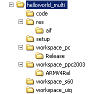

:warning: _This file was converted from the EDGELIB 4.02 documentation from 2012 and is included for historic purposes. The documentation is not maintained anymore: information is outdated and external links might be broken._

# Multi-platform considerations

## Handling multiple workspaces with one source
When developing multi-platform applications, create a workspace for every target platform and keep one source folder. A multi-platform development folder structure could look like this:



There are several workspace folders containing a project for each target platform, a shared resource folder, a setup folder for windows mobile, and a shared code folder. External resources like graphics, sound and music can be stored in a subfolder like: `C:\projects\helloworld\res\graphics\symbian_s60`.

## A multi-platform source code
When programming a multi-platform C++ source file, there are little differences between different platforms. Symbian applications don't include resources in the source code. These lines of code should be disabled by using the #ifdef macro's. Keep in mind that some non-EDGELIB functions may not be supported by each platform. Try to use as much EDGELIB functions as possible. A multi-platform helloworld.cpp file would look like this:

_helloworld.cpp (96 lines)_
```c++
/////////////////////////////////////////////////////////////////////
// Code/helloworld.cpp
// One of the EDGELIB tutorial samples (multi-platform)
//
// Copyright (c) 2006-2017 Elements Interactive B.V.
// http://www.edgelib.com
//
// Show "hello world" on the screen and exit by clicking/tapping the
// window or hitting a key
/////////////////////////////////////////////////////////////////////
 
/////////////////////////////////////////////////////////////////////
// Include and link the library                                    //
/////////////////////////////////////////////////////////////////////
 
//Include EDGELIB
#include "edgemain.h"
 
//Link the EDGELIB static library
#pragma comment(lib, "edge.lib")
 
#if defined(DEVICE_WIN32) && !defined(__EDGEIDE__)
 
//Include internal resources for native Win32 builds
#include "resource.h"
 
#else
 
#define IDI_MAIN  0
 
#endif
 
/////////////////////////////////////////////////////////////////////
// Class definition                                                //
/////////////////////////////////////////////////////////////////////
 
//The main class
class ClassMain : public ClassEdge
{
    public:
        ClassMain(void);
        ~ClassMain(void);
        ERESULT OnDisplayConfig(EDISPLAYCONFIG *config);
        ERESULT OnNextFrame(ClassEDisplay *display, unsigned long timedelta);
        void OnButtonDown(unsigned long bnr, EBUTTONLIST *blist);
        void OnStylusDown(POINT pnt);
};
 
 
/////////////////////////////////////////////////////////////////////
// ClassMain: public                                               //
/////////////////////////////////////////////////////////////////////
 
//ClassMain: constructor
ClassMain::ClassMain(void)
{
}
 
//ClassMain: destructor
ClassMain::~ClassMain(void)
{
}
 
//Configure display
ERESULT ClassMain::OnDisplayConfig(EDISPLAYCONFIG *config)
{
    ClassEStd::StrCpy(config->caption, "Hello World!");
    config->icon = IDI_MAIN;
    return(E_OK);
}
 
//Callback: Called every frame
ERESULT ClassMain::OnNextFrame(ClassEDisplay *display, unsigned long timedelta)
{
    display->buffer.DrawFont(0, 0, &display->fontinternal, "Hello World!");
    return(E_OK);
}
 
//Callback: Called when the user pressed a key or button
void ClassMain::OnButtonDown(unsigned long bnr, EBUTTONLIST *blist)
{
    Quit();
}
 
//Callback: Called when the user points the stylus down or clicks the left mouse button
void ClassMain::OnStylusDown(POINT pnt)
{
    Quit();
}
 
 
/////////////////////////////////////////////////////////////////////
// The program entry point                                         //
/////////////////////////////////////////////////////////////////////
 
ClassEdge *EdgeMain(EDGESTARTUP *data){ return(new ClassMain); }
```

## Notes
When developing a multi-platform application, you need to understand the limits of these platforms to ensure the code actually works on each platform. Each platform has a different type of input and a different resolution. The input problem can be solved by mapping a maximum of three actions buttons to in-game actions. These key mappings would be set for each platform separately. The graphics problem can be fixed by using a dynamic screen layout with one set of graphics, or by using a different set of graphics for each platform (and defining screen layouts separately).

A good way to handle programming definitions separately for each platform, is to add a `def_platf.h` header file into each workspace folder, instead of adding it to the shared source folder. More suggestions on how to get started with multi-platform EDGELIB projects can be found in our [multi-platform development tutorial](tutorials_multiplatform.md).

## Download tutorial project
Here is a [sample that can be downloaded](files/helloworld_multiplatform.zip) which contains the result of this tutorial.

## Getting started tutorials
* [EDGELIB installation](tutorials_gettingstarted_edgeinstallation.md)
* [Getting started with Apple iOS](gettingstarted_iphone.md)
* [Getting started with Google Android](gettingstarted_android.md)
* [Getting started with Symbian](gettingstarted_symbian.md)
* [Getting started with Windows Mobile](gettingstarted_windowsmobile.md)
* [Getting started with Maemo 5](gettingstarted_maemo5.md)
* [Getting started with Antix Game Player](gettingstarted_antix.md)
* [Getting started with Windows desktop](gettingstarted_desktop.md)
* [Getting started with Linux desktop](gettingstarted_linux.md)
* [Getting started with Mac OS X](gettingstarted_macosx.md)
* [Getting started with GP2X](gettingstarted_gp2x.md)
* [Getting started with Gizmondo](gettingstarted_gizmondo.md)
* **Multi-platform considerations**

