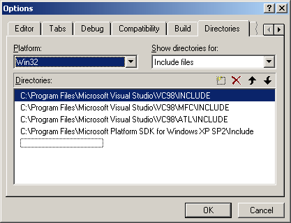
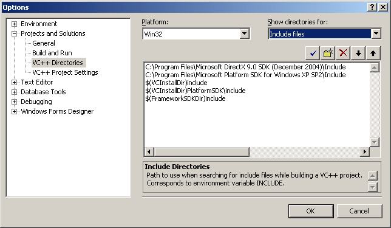
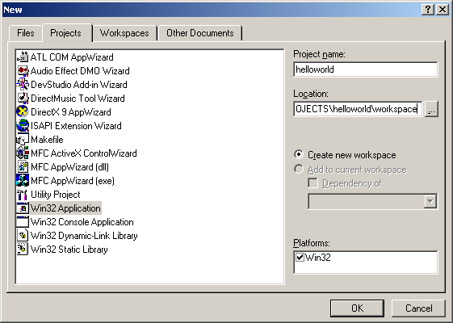
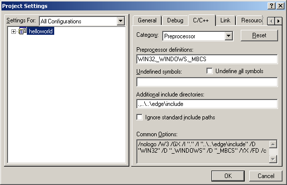
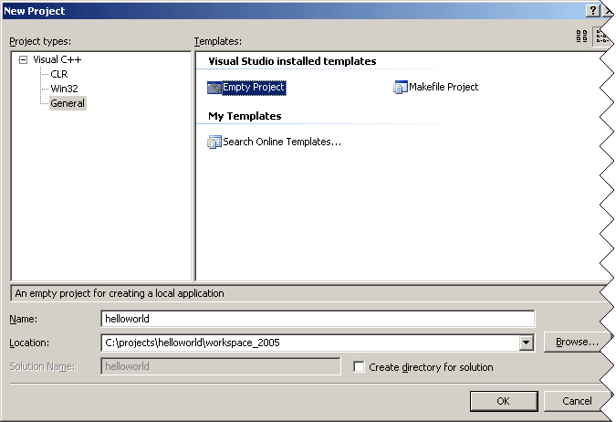
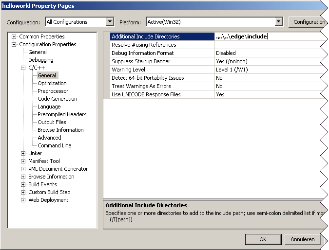

:warning: _This file was converted from the EDGELIB 4.02 documentation from 2012 and is included for historic purposes. The documentation is not maintained anymore: information is outdated and external links might be broken._

# Getting started with Windows desktop

## Required tools and SDKs
For Windows desktop development we recommend Visual C++ 6.0 or Visual C++ 2005 which will be covered by this tutorial. The Express edition of Visual C++ 2005 can be downloaded for free. You will also need an additional platform SDK.

* [DirectX downloads](http://www.microsoft.com/windows/directx/default.aspx)
* [Windows® Server 2003 SP1 Platform SDK](http://www.microsoft.com/downloads/details.aspx?FamilyId=A55B6B43-E24F-4EA3-A93E-40C0EC4F68E5&amp;displaylang=en)
* [Microsoft Visual C++ 2005 Express](http://msdn.microsoft.com/vstudio/express/visualc/download/default.aspx)

## Installation
After installing the C++ compiler we need to the platform SDK and set up the header and library folders. When installing the platform SDK, select the Windows XP SP2 SDK and install it in the default folder. Installing the platform SDK will also enable Visual C++ 2005 express to create Win32 applications.

## Adding additional include/library folders in Visual C++ 6.0
To set up the include/library folders for the platform SDK, open Visual C++ and go to: tools -> options. Select the tab "Directories" to add include and library paths.



Click on the dotted rectangle to add a new folder. Link the include and library folders of the platform SDK and everything should be set.

## Adding additional include/library folders in Visual C++ 2005
To add include/library folders in this compiler, go to tools -> options to open a new window. After that, select projects and Solutions -> VC++ directories. Choose Win32 as the platform, and choose include files or library files to add these new folders.



Click on the yellow folder icon to add a new folder. Link the include and library folders of the platform SDK, then everything should be set.

## Set up a Visual C++ 6.0 project workspace
After creating a project folder and installing EDGELIB and Microsoft Visual C++ 6.0, you can create a workspace. A workspace contains a source code structure for building Windows desktop applications. Open Visual C++ and create a new workspace with file -> new.



When creating a new workspace you can choose various types of applications. We will create a new Win32 application for our helloworld application at: `C:\projects\helloworld\workspace`. After that, create an empty project and finish. The workspace should be ready. 
When the workspace has been created, we will create a new folder inside the helloworld project. This folder will be `C:\projects\helloworld\code` and will contain all source files. Create a helloworld.cpp from file -> new, make sure it is created inside the code folder. The next thing to do is to tell the compiler where to locate the EDGELIB header files and libraries. Go to project -> settings and click on the tab "C/C++".



First select "all configurations" from the "settings for" selection box at the left side of the window, this will make sure the new project settings take effect for both debug and release builds. Then select "preprocessor" category, right below the tab. A new option called "additional include directories" will appear. You can enter `.,..\..\edge\include` (relative path) or `.,C:\projects\edge\include` (absolute path), so the compiler can find the EDGELIB header files. The same thing can be done for libraries. Go to the "link" tab and to the input category to change the option "additional library path". This path should point to the correct library, which is in this case: `..\..\edge\lib\pc-x86`

## Set up a Visual C++ 2005 project solution
Creating Windows Desktop projects in Visual C++ 2005 is a little bit different than using Visual C++ 6.0. All editions of Visual C++ 2005 are able to create a Win32 project, an application that can be built for Windows desktop. This project will be created in a new folder inside the helloworld project folder: `C:\projects\helloworld\workspace_2005`. Create a new project with file -> new -> project.



Select general, then empty project and click OK. Adding a .cpp file can be done by right clicking on the source folder in the solution explorer. Choose Add -> New Item to create a new file or Add -> Existing item to add an already existing .cpp file. Add helloworld.cpp, which will be located in this folder: `C:\projects\helloworld\code`. The final step is to set up the project properties. Right click on the project (on the left side of the screen) and select "properties".



The additional include and library directories will be the same for every configuration. This can be set by using the selection boxes at the top of the screen. To set the additional include directory, open configuration properties -> C/C++. Set it to `.,..\..\edge\include`. Also add the additional library directories which can be changed by opening configuration properties -> Linker -> General. This additional library directory will be set to `..\..\edge\lib\pc-x86_vc2005`. To disable the "can't find libc.lib" warning, go to configuration properties -> Linker -> Input and add libc to the ignore specific library list.

## Create a helloworld example
It's time to create a working sample that's able to run on a Windows PC. Open `helloworld.cpp` and paste the following code inside the editor window:

_helloworld.cpp (88 lines)_
```c++
/////////////////////////////////////////////////////////////////////
// Code/helloworld.cpp
// One of the EDGELIB tutorial samples for Windows desktop
//
// Copyright (c) 2006-2017 Elements Interactive B.V.
// http://www.edgelib.com
//
// Show "hello world" on the screen and exit by tapping the screen or
// hitting a key
/////////////////////////////////////////////////////////////////////
 
 
/////////////////////////////////////////////////////////////////////
// Include and link the library                                    //
/////////////////////////////////////////////////////////////////////
 
//Include EDGELIB
#include "edgemain.h"
 
//Link the EDGELIB static library
#pragma comment(lib, "edge.lib")
 
//Include internal resources
#include "resource.h"
 
/////////////////////////////////////////////////////////////////////
// Class definition                                                //
/////////////////////////////////////////////////////////////////////
 
//The main class
class ClassMain : public ClassEdge
{
    public:
        ClassMain(void);
        ~ClassMain(void);
        ERESULT OnDisplayConfig(EDISPLAYCONFIG *config);
        ERESULT OnNextFrame(ClassEDisplay *display, unsigned long timedelta);
        void OnButtonDown(unsigned long bnr, EBUTTONLIST *blist);
        void OnStylusDown(POINT pnt);
};
 
 
/////////////////////////////////////////////////////////////////////
// ClassMain: public                                               //
/////////////////////////////////////////////////////////////////////
 
//ClassMain: constructor
ClassMain::ClassMain(void)
{
}
 
//ClassMain: destructor
ClassMain::~ClassMain(void)
{
}
 
//Configure display
ERESULT ClassMain::OnDisplayConfig(EDISPLAYCONFIG *config)
{
    ClassEStd::StrCpy(config->caption, "Hello World!");
    return(E_OK);
}
 
//Callback: Called every frame
ERESULT ClassMain::OnNextFrame(ClassEDisplay *display, unsigned long timedelta)
{
    display->buffer.DrawFont(0, 0, &display->fontinternal, "Hello World!");
    return(E_OK);
}
 
//Callback: Called when the user pressed a key or button
void ClassMain::OnButtonDown(unsigned long bnr, EBUTTONLIST *blist)
{
    Quit();
}
 
//Callback: Called when the user points the stylus down or clicks the left mouse button
void ClassMain::OnStylusDown(POINT pnt)
{
    Quit();
}
 
 
/////////////////////////////////////////////////////////////////////
// The program entry point                                         //
/////////////////////////////////////////////////////////////////////
 
ClassEdge *EdgeMain(EDGESTARTUP *data){ return(new ClassMain); }
```

This sample code has been written specifically for Windows desktop. A multi-platform version can be found at the multi-platform section. 
Build and run the sample with build -> execute. Run it, and it should show "Hello World!" at the top of the screen. Click the mouse or press a key to quit.

## Adding resources
Resource scripts can be used to add an icon to your application or add other internal resources. To create a new resource script go to: file -> new. The resource script should be added to your workspace folder, instead of the code folder. Include resource.h inside your code to be able to access them.

When the resources are added, a new tab called "ResourceView" appears on the workspace browser at the bottom left of the screen. To add an icon: click on this new tab, right click on the resource folder and select "insert". A new icon can be created. A good idea is to create a new folder like `C:\projects\helloworld\res` to separate your resources from your source code. You can draw your icon using the internal icon editor, build in embedded visual C++. The icon can be linked to the program by adding the following line to `ClassMain::OnDisplayConfig`: `config->icon = IDI_MAIN`.

Note: Resources can't be created in Visual Studio Express editions. Skip the above when using one of these compilers.

After adding the resource file, the Visual C++ express compiler may complain about a missing "afxres.h" file. Add this file to the solution folder with the following text:

_afxres.h (3 lines)_
```c++
//Fix for Visual Studio 2005 express
 
#include <windows.h> 
```

## Download tutorial project
Here is a [sample that can be downloaded](files/helloworld_desktop.zip) which contains the result of this tutorial.

## Getting started tutorials
* [EDGELIB installation](tutorials_gettingstarted_edgeinstallation.md)
* [Getting started with Apple iOS](gettingstarted_iphone.md)
* [Getting started with Google Android](gettingstarted_android.md)
* [Getting started with Symbian](gettingstarted_symbian.md)
* [Getting started with Windows Mobile](gettingstarted_windowsmobile.md)
* [Getting started with Maemo 5](gettingstarted_maemo5.md)
* [Getting started with Antix Game Player](gettingstarted_antix.md)
* **Getting started with Windows desktop**
* [Getting started with Linux desktop](gettingstarted_linux.md)
* [Getting started with Mac OS X](gettingstarted_macosx.md)
* [Getting started with GP2X](gettingstarted_gp2x.md)
* [Getting started with Gizmondo](gettingstarted_gizmondo.md)
* [Multi-platform considerations](gettingstarted_multiplatform.md)

