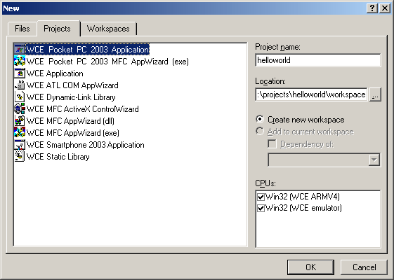
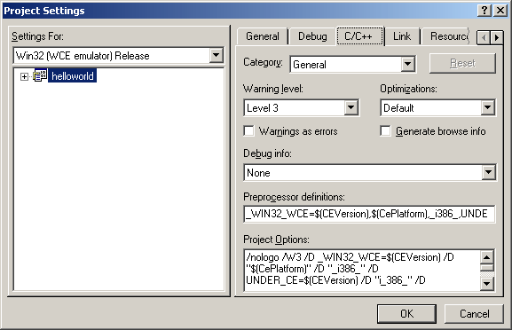
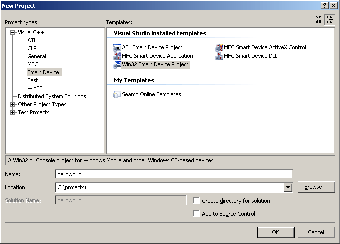
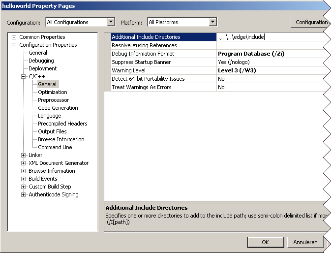

:warning: _This file was converted from the EDGELIB 4.02 documentation from 2012 and is included for historic purposes. The documentation is not maintained anymore: information is outdated and external links might be broken._

# Getting started with Windows Mobile

## Required tools and SDKs
To develop for Windows Mobile (Pocket PC and Smartphone), you need Embedded Visual C++ and an SDK for each target platform. Windows Mobile is backwards compatible, for example applications developed for Pocket PC 2002 will also work on Pocket PC 2003/2005 but new features won't be available. When developing native Windows Mobile 5.0 applications, you need Visual C++ 2005 standard edition and additional SDKs.

* [Windows Mobile download center](http://msdn.microsoft.com/mobility/downloads/)
* [Embedded Visual tools 3.0 + Windows Mobile 2002 SDK's](http://www.microsoft.com/downloads/details.aspx?familyid=f663bf48-31ee-4cbe-aac5-0affd5fb27dd&amp;displaylang=en)
* [Embedded Visual C++ 4.0](http://www.microsoft.com/downloads/details.aspx?familyid=1dacdb3d-50d1-41b2-a107-fa75ae960856&amp;languageid=f49e8428-7071-4979-8a67-3cffcb0c2524&amp;displaylang=en)
* [SDK list](http://msdn.microsoft.com/mobility/downloads/sdks/default.aspx)

## Installation
When all tools and SDKs are downloaded they can be installed. This is the best order to install these tools to be able to develop for Windows Mobile 2002, 2003 and 2005 on the same workstation:

* Embedded Visual C++ 4.0 + service packs
* Embedded Visual tools 3.0 + Windows Mobile 2002 SDKs (included in the setup program)
* Windows Mobile 2003 SDKs
* Visual C++ 2005 (optional)
* Windows Mobile 2005 SDKs (optional)

## Set up a Windows Mobile project workspace using Embedded Visual C++
After creating a project folder and installing EDGELIB and Microsoft Visual tools, you can create a workspace. A workspace contains a source code structure for building Windows Mobile applications. Windows Mobile 2002 workspaces can be edited with Embedded Visual tools 3.0 and Windows Mobile 2003 workspaces can be edited with Embedded Visual C++ 4.0. These workspaces have the same extension and will be opened by Embedded Visual tools 3.0 by default. To open a workspace with Embedded Visual C++ 4.0, right click on a workspace and open it with Embedded Visual C++ 4.0. Open Embedded Visual tools 3.0 or Embedded Visual C++ 4.0 (depending on the target platform) and create a new workspace with file -> new.



There aren't many differences between Embedded Visual tools 3.0 and Embedded Visual C++ 4.0 when working with workspaces. This tutorial will take Embedded Visual C++ 4.0 as an example. When creating a new workspace you can choose your destination device (Pocket PC or Smartphone as seen in the screenshot). We will create a new Pocket PC 2003 project workspace for our helloworld application at: `C:\projects\helloworld\workspace`. After that, create an empty project and finish. The workspace should be ready. 
When the workspace has been created, we will create a new folder inside the helloworld project. This folder will be `C:\projects\helloworld\code` and will contain all source files. Create a helloworld.cpp from file -> new, make sure it is created inside the code folder. The next thing to do is to tell the compiler where to locate the EDGELIB header files and libraries. Go to project -> settings and click on the tab "C/C++".



First select "all configurations" from the "settings for" selection box at the left side of the window, this will make sure the new project settings take effect for both debug and release builds. Then select "preprocessor" category, right below the tab. A new option called "additional include directories" will appear. You can enter `.,..\..\edge\include` (relative path) or `.,C:\projects\edge\include` (absolute path), so the compiler can find the EDGELIB header files. The same thing can be done for libraries. Go to the "link" tab and to the input category to change the option "additional library path". This path should point to the correct library, which is in this case: `..\..\edge\lib\ppc2003-arm`

## Creating a Windows Mobile project in Visual C++ 2005
Creating Windows Mobile projects in Visual C++ 2005 is a little bit different than using Embedded Visual C++. Visual C++ 2005 standard edition is able to create a Smart Device project, an application that can be built for Windows Mobile 2003 and Windows Mobile 5.0. This project will be created in a new folder inside the helloworld project folder: `C:\projects\helloworld\workspace_2005`. Create a new Smart Device project with file -> new -> project.



After clicking OK, it's possible to add multiple Windows Mobile platforms to this project. When compiling, each platform will have its own Release folder containing the executable. After adding these platforms, go to the next screen and enable the "empty project" checkbox, then finish. Adding a .cpp file can be done by right clicking on the source folder in the solution explorer. Choose Add -> New Item to create a new file or Add -> Existing item to add an already existing .cpp file. Add helloworld.cpp, which will be located in this folder: `C:\projects\helloworld\code`. The final step is to set up the project properties. Right click on the project (on the left side of the screen) and select "properties".



The additional include directory will be the same for every platform and configuration. This can be set by using the 2 selection boxes at the top of the screen. To set the additional include directory, open configuration properties -> C/C++. Set it to `.,..\..\edge\include`. Also add the additional library directories which can be changed by opening configuration properties -> Linker. When changing this option, set the configuration to all configurations and select a platform (each platform uses a different library path). For a Windows Mobile 5.0 Pocket PC, this additional library directory will be set to `..\..\edge\lib\ppc2005-arm`.

## Create an helloworld example
It's time to create a working sample that's able to run on a Pocket PC. Open helloworld.cpp and paste the following code inside the editor window:

_helloworld.cpp (88 lines)_
```c++
/////////////////////////////////////////////////////////////////////
// Code/helloworld.cpp
// One of the EDGELIB tutorial samples for Windows Mobile
//
// Copyright (c) 2006-2017 Elements Interactive B.V.
// http://www.edgelib.com
//
// Show "hello world" on the screen and exit by tapping the screen or
// hitting a key
/////////////////////////////////////////////////////////////////////
 
 
/////////////////////////////////////////////////////////////////////
// Include and link the library                                    //
/////////////////////////////////////////////////////////////////////
 
//Include EDGELIB
#include "edgemain.h"
 
//Link the EDGELIB static library
#pragma comment(lib, "edge.lib")
 
//Include internal resources
#include "resource.h"
 
/////////////////////////////////////////////////////////////////////
// Class definition                                                //
/////////////////////////////////////////////////////////////////////
 
//The main class
class ClassMain : public ClassEdge
{
    public:
        ClassMain(void);
        ~ClassMain(void);
        ERESULT OnDisplayConfig(EDISPLAYCONFIG *config);
        ERESULT OnNextFrame(ClassEDisplay *display, unsigned long timedelta);
        void OnButtonDown(unsigned long bnr, EBUTTONLIST *blist);
        void OnStylusDown(POINT pnt);
};
 
 
/////////////////////////////////////////////////////////////////////
// ClassMain: public                                               //
/////////////////////////////////////////////////////////////////////
 
//ClassMain: constructor
ClassMain::ClassMain(void)
{
}
 
//ClassMain: destructor
ClassMain::~ClassMain(void)
{
}
 
//Configure display
ERESULT ClassMain::OnDisplayConfig(EDISPLAYCONFIG *config)
{
    ClassEStd::StrCpy(config->caption, "Hello World!");
    return(E_OK);
}
 
//Callback: Called every frame
ERESULT ClassMain::OnNextFrame(ClassEDisplay *display, unsigned long timedelta)
{
    display->buffer.DrawFont(0, 0, &display->fontinternal, "Hello World!");
    return(E_OK);
}
 
//Callback: Called when the user pressed a key or button
void ClassMain::OnButtonDown(unsigned long bnr, EBUTTONLIST *blist)
{
    Quit();
}
 
//Callback: Called when the user points the stylus down or clicks the left mouse button
void ClassMain::OnStylusDown(POINT pnt)
{
    Quit();
}
 
 
/////////////////////////////////////////////////////////////////////
// The program entry point                                         //
/////////////////////////////////////////////////////////////////////
 
ClassEdge *EdgeMain(EDGESTARTUP *data){ return(new ClassMain); }
```

This sample code has been written specifically for Windows Mobile. A multi-platform version can be found at the multi-platform section. 
Build the sample with build -> rebuild all. Build the sample for the device instead of the emulator and upload it to your Pocket PC. Run it, and it should show "Hello World!" at the top of the screen. Tap the stylus or press a button to quit.

## Adding resources
Resource scripts can be used to add an icon to your application or add other internal resources. To create a new resource script go to: file -> new. The resource script should be added to your workspace folder, instead of the code folder. Include resource.h inside your code to be able to access them. 
After the resources has been added, a new tab called "ResourceView" appears on the workspace browser at the bottomleft of the screen. To add an icon: click on this new tab, right click on the resource folder and select "insert". A new icon can be created. A good idea is to create a new folder like `C:\projects\helloworld\res` to separate your resources from your source code. You can draw your icon using the internal icon editor, build in Embedded Visual C++ or Visual C++ 2005. The icon can be linked to the program by adding the following line to `ClassMain::OnDisplayConfig`: `config->icon = IDI_MAIN`.

## Compiling for Windows Mobile Smartphone
When using Embedded Visual C++, Windows Mobile Smartphones require an extra headerfile to be included, or else the compiler will generate an error message. A file called `afxres.h` should be created inside the workspace folder containing the following code:

_afxres.h (5 lines)_
```c++
#include <windows.h>
#include <aygshell.h>
#include <tpcuser.h>
 
#define TPC 
```

## Native high-resolution applications
Some Windows Mobile 2003 SE devices have a display that supports high-resolution, like a Pocket PC with a resolution of 480x640 pixels (VGA) instead of 240x320, or Windows Mobile Smartphones supporting a resolution of 240x320 (QVGA). Usually, applications developed with EDGELIB will be emulated on these screens to enlarge the display. It's also possible to develop high resolution native applications with EDGELIB. When using Embedded Visual C++, you need to manually edit your resource script and enable high resolution within the EDGELIB configuration structure. Edit the resource script with your favourite text editor and add the following line at the bottom:

_resource.rc (1 line)_
```c++
HI_RES_AWARE CEUX {1} //To turn off the emulation layer 
```

## Building CAB files
When the application is finished, a CAB file can be build to install it on the target device. The following tools can be found within the Windows Mobile SDKs: `cabwiz.exe`, `cabwizsp.exe`, `makecab.exe` and `cabwiz.ddf`. Create a new file `install.inf` and paste the following code:

_install.inf (42 lines)_
```c++
[Version]
Signature   = " NT$"
Provider    = "EDGELIB"
CESignature = " CE$"
 
 
[CEDevice]
BuildMax    = 0xE0000000
 
 
[CEStrings]
AppName     = "Helloworld"
InstallDir  = %CE1%\%AppName%
 
 
[DefaultInstall]
CopyFiles   = ExeFiles
CEShortcuts = Startmenu
 
 
[SourceDisksNames.ARMPPC]
1 = ,"ExeFiles",,..\workspace\ARMV4Rel
[SourceDisksNames.ARMPPC2005]
1 = ,"ExeFiles",,"..\workspace_2005\Windows Mobile 5.0 Pocket PC SDK (ARMV4I)\Release"
 
 
[SourceDisksFiles]
Helloworld.exe = 1
 
 
[DestinationDirs]
ExeFiles  = 0, %InstallDir%
Startmenu = 0, %CE11%\Edge
DefaultDestDir = 0, %InstallDir%
 
 
[ExeFiles]
"Helloworld.exe"
 
 
[Startmenu]
"Helloworld", 0, "Helloworld.exe"
```

The value in the `[CEDevice]` section can be changed if the application doesn't support screen rotation or square screens. Change it to `0xA0000000` to only support square screens and `0xC0000000` to only support screen rotation, `0xE0000000` supports both. Remove this section to support none of these features.

Build a CAB file for Pocket PC's with the following command: `cabwiz install.inf /cpu ARMPPC` 
Build a CAB file for Smartphones with the following command: `cabwizsp install.inf /cpu ARMWSP`

## Download tutorial project
Here is a [sample that can be downloaded](files/helloworld_windowsmobile.zip) which contains the result of this tutorial.

## Getting started tutorials
* [EDGELIB installation](tutorials_getting_started_edgeinstallation.md)
* [Getting started with Apple iOS](getting_started_iphone.md)
* [Getting started with Google Android](getting_started_android.md)
* [Getting started with Symbian](getting_started_symbian.md)
* **Getting started with Windows Mobile**
* [Getting started with Maemo 5](getting_started_maemo5.md)
* [Getting started with Antix Game Player](getting_started_antix.md)
* [Getting started with Windows desktop](getting_started_desktop.md)
* [Getting started with Linux desktop](getting_started_linux.md)
* [Getting started with Mac OS X](getting_started_macosx.md)
* [Getting started with GP2X](getting_started_gp2x.md)
* [Getting started with Gizmondo](getting_started_gizmondo.md)
* [Multi-platform considerations](getting_started_multiplatform.md)

