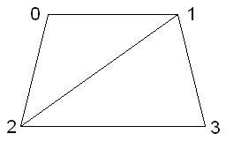

:warning: _This file was converted from the EDGELIB 4.02 documentation from 2012 and is included for historic purposes. The documentation is not maintained anymore: information is outdated and external links might be broken._

# Advanced 3D functions

## Overview
This chapter will describe more advanced functionality, like creating models manually and locking 3D surfaces.

## The 3D model structure
A model is built by points (vertices) in 3D space. A vertex can have a position, color, texture coordinate and normal. Texture coordinates are used for texture mapping, normals are used for lighting. Normals can also be calculated automatically.

Vertices are organised into triangles, linking three vertices into a polygon. Simple models (with few polygons) may be made manually, more complex models may be loaded from a 3D files, generated by a 3D render program. For example, when creating a rectangle in 3D we need four vertices (one vertex per corner) and link them into two polygons. These polygons need to be created in a counter clockwise manner, otherwise the polygon will not be visible. Here is a code sample on how to create this model manually (normals are calculated by EDGELIB):

_Code (11 lines)_
```c++
E3DSurface rectangle;
if (display->CreateSurface(&rectangle, 4, 2) == E_OK)
{
    rectangle.SetVertex(0, -2048, -2048, 0);    // top left corner
    rectangle.SetVertex(1,  2048, -2048, 0);    // top right corner
    rectangle.SetVertex(2, -2560,  2048, 0);    // bottom left corner
    rectangle.SetVertex(3,  2560,  2048, 0);    // bottom right corner
    rectangle.SetPolygon(0, 0, 2, 1);
    rectangle.SetPolygon(1, 1, 2, 3);
    rectangle.CalculateNormals();
}
```

This is the same model, shown as a picture. Vertex point numbers are added for clarity:



## Texture mapping
After creating the shape of the model, it is often desirable to map textures on this object. Each vertex contains a reference to a specific position of the texture image. Using these positions, the texture is drawn on the polygon during the render process. Binding textures is pixel independent. This means that value 0 marks the first pixel and value 65536 marks the last pixel. Binding a texture on the 3D rectangle is easy.

_Code (4 lines)_
```c++
rectangle.SetTexCoord(0, 0, 0);
rectangle.SetTexCoord(1, 0, 65536);
rectangle.SetTexCoord(2, 65536, 0);
rectangle.SetTexCoord(3, 65536, 65536);
```

Values larger than 65536 are also possible, this will repeat the texture over the polygon. If the model is loaded from a file, texture coordinates are usually already present and don't have to be mapped.

## Changing colors
It's possible to give each polygon a different color. This can be done when creating a model manually, but it's also possible to change colors real time. This can be useful when a model has been loaded from a file, but some polygon colors need to be adjusted. Here is a code sample on how to change the colors:

_Code (2 lines)_
```c++
model.SetModelColor(E_RGBX(0, 255, 0)); //Change the entire model color to green
model.SetColor(0, E_RGBX(255, 0, 0));   //Change the first vertex color to red 
```

## Change render size
When using the internal EDGELIB 3D renderer, it's possible to change the size of the 3D renderer. Here is an example that uses a fixed rendering size. The size of the rendered model will not increase on displays with a higher resolution:

_Code (1 line)_
```c++
display->SetRenderSize(100);
```

## Chapters
* [OpenGL (ES) implementations](tutorials_3d_opengl.md)
* [3D helper functions](tutorials_3d_helperfunctions.md)
* **Advanced 3D functions**

