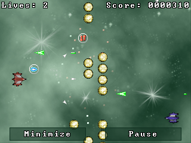

:warning: _This file was converted from the EDGELIB 4.02 documentation from 2012 and is included for historic purposes. The documentation is not maintained anymore: information is outdated and external links might be broken._

# Creating a complete game

This tutorial will be a step-by-step guide on how to write a simple game using EDGELIB. It covers several steps in the development process, and by the last chapter you'll have a working game that's able to run on several devices. Every step will be described, from the design phase to having a working game on a mobile device.

The result of this tutorial can be downloaded at the last chapter and can be found in the samples folder of the EDGELIB SDK.

On the right you can see a screenshot of the game in action.

This tutorial contains the following chapters:

* [Designing a game](tutorials_blastar_design.md)
* [The project framework](tutorials_blastar_framework.md)
* [Creating graphics](tutorials_blastar_graphics.md)
* [The loader module](tutorials_blastar_loader.md)
* [Platform definitions](tutorials_blastar_definitions.md)
* [The menu module](tutorials_blastar_menu.md)
* [The level module](tutorials_blastar_level.md)
* [Using sprites](tutorials_blastar_sprites.md)
* [Player control](tutorials_blastar_control.md)
* [Wall of objects](tutorials_blastar_objects.md)
* [Collision detection](tutorials_blastar_collision.md)
* [The boss](tutorials_blastar_boss.md)
* [Refining the game](tutorials_blastar_refining.md)
* [Adding powerups](tutorials_blastar_powerups.md)
* [Special effects](tutorials_blastar_specialfx.md)
* [Completing the game](tutorials_blastar_completing.md)

## Version changes
- EDGELIB 2.95: Rewritten the tutorial to use the newest Edge features 
- EDGELIB 2.50: Changes to reflect the new supported GP2X platform 
- EDGELIB 2.10: Changes to reflect the new supported Series 80 and Series 90 platforms, usage of font alignment flags and new definitions

