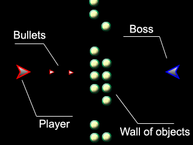

:warning: _This file was converted from the EDGELIB 4.02 documentation from 2012 and is included for historic purposes. The documentation is not maintained anymore: information is outdated and external links might be broken._

# Designing a game

## Basic gameplay and controls
The first and most important part of designing the game, is the actual gameplay. We're going to design an action shoot-em-up game suitable for any device supported by EDGELIB. That's why we're also going to deal with the controls of the game. The name of the game will be: Blastar.

The player will control his ship in two directions (up and down), and the action will take place on the entire screen. This means that there will be no scrolling involved and the player will have a good view on the gameplay. The good part about only moving up and down, is because it can be done with almost every input device:

* The scrollwheel
* The directional pad
* The touch screen
* Additional keys like '2' and '8' on the phone

Another advantage is that a new player will be able to learn the game mechanics very swiftly. There will also be an action button for firing bullets to stop hostile objects and defeating enemies. An auto-shoot option will also be included for the player's convenience.

We will use the built-in input module for easier input handling. It also contains predefined mappings suitable for this game.

## The game concept
Now it's time to further work on the game concept: if there are enemies, powerups, levels, etc. The goal of this game is to blast through a wall of objects until the boss can be shot (he's hiding behind the wall of objects). When the boss is defeated, the player will go to the next level.

Powerups will also be added to keep the game interesting, and will appear when certain objects are destroyed. To add challenge to the game, the boss will regularly fire missiles into the player's direction which needs to be evade. The challenge will increase when levels get higher. This can be done by increasing the amount of missiles that are shot by the boss, and expanding the wall of objects that has to be shot.

## Game features
Besides the gameplay itself, a number of options will be added. The player will be able to customize the following parts of the game:

Enabling or disabling automatic shooting: 
This will improve the game controls on phone devices. It will also be possible to play the game with one hand.

Choose a level to start on: 
The advanced player will be able to start on a challenging level. This will also work as a continue option when a game is over.

## Menu's
The game will have 2 menu's: one in-game pause menu and a main menu when starting up the game. The main menu will contain the options to customize the game, an option to start a game and an option to quit a game. The pause menu will contain options to customize the game, to resume the game, to minimize and to quit a game.

## The final design phase
This is the part where every part of the design is evaluated and small errors are worked out. For this game it's a good idea to re-evaluate the game control and controlling menu's through the input conventions.

When in-game, the player expects to bring up a menu by using the soft buttons, or tapping a button with the stylus. A good idea is to duplicate parts of the phone interface in-game. When using the phone, 2 menu options can be seen at the bottom of the screen that can be controlled with the 2 buttons on the phone below the screen. This can be used in-game as well. The stylus can also be used to tap on these 2 options to bring up a menu.

The menu's will be browsed with the directional pad or scrollwheel, and options are selected with the default select button (usually a button in the middle of the directional pad). Options will also be selected when pressing the jog, or by pressing one of the 2 buttons at the top of the screen. It's also a good idea to add stylus control to the menu's, selecting a menu option by tapping on it with the stylus.

The last thing to do is to create a simple graphic picture, on how the game will look (which are called mockups). Here is a mockup of the in-game screen:

## Chapters
* **Designing a game**
* [The project framework](tutorials_blastar_framework.md)
* [Creating graphics](tutorials_blastar_graphics.md)
* [The loader module](tutorials_blastar_loader.md)
* [Platform definitions](tutorials_blastar_definitions.md)
* [The menu module](tutorials_blastar_menu.md)
* [The level module](tutorials_blastar_level.md)
* [Using sprites](tutorials_blastar_sprites.md)
* [Player control](tutorials_blastar_control.md)
* [Wall of objects](tutorials_blastar_objects.md)
* [Collision detection](tutorials_blastar_collision.md)
* [The boss](tutorials_blastar_boss.md)
* [Refining the game](tutorials_blastar_refining.md)
* [Adding powerups](tutorials_blastar_powerups.md)
* [Special effects](tutorials_blastar_specialfx.md)
* [Completing the game](tutorials_blastar_completing.md)

