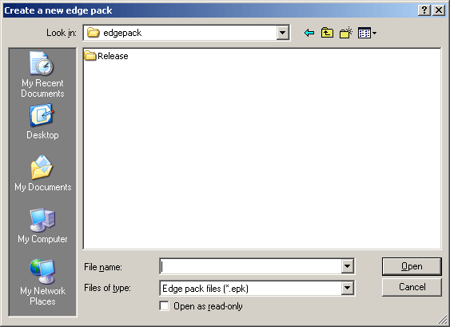
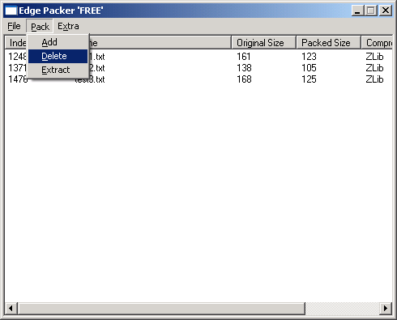

:warning: _This file was converted from the EDGELIB 4.02 documentation from 2012 and is included for historic purposes. The documentation is not maintained anymore: information is outdated and external links might be broken._

# Using the EDGELIB Packer tool

## About the EDGELLIB Packer tool
The EDGELIB Packer tool is a tool available to every EDGELIB developer. It runs on Windows and provides an easy user interface and useful commandline options to create new packages and to add, delete and extract files. This page will explain how to use the tool, and how to handle different vendor signatures.

## How to use the EDGELIB Packer tool
Using the EDGELIB Packer tool is easy. Create a new package file by selecting the menu item file -> new. A new window opens where a filename can be entered in the desired folder.

Opening existing files is similar to creating a new file.

Files can be added to the package by selecting the menu item pack -> add, or by dragging the files on the EDGELIB Packer window. Delete or extract files by selecting the files and using the pack menu.

Switch the active vendor by clicking on pack -> change vendor. Only files with the vendor signature "FREE" or vendors with correct unlock codes can be opened.

## Configuring vendor signatures for the EDGELIB Packer
Vendor signatures are used to protect the resources within the package files.

As a default, the EDGELIB Packer tool contains one active vendor signature: "FREE". To add a new signature, go through tools -> configure vendors. Add new vendors by adding new lines with a four character vendor signature and an unlock code.

## Chapters
* [Getting Started](tutorials_gettingstarted.md)
* [Multi-platform development](tutorials_multiplatform.md)
* [Using ClassESound and Hekkus Sound System](tutorials_hekkus.md)
* [Using files](tutorials_files.md)
* [Dynamic registration](tutorial_rpn.md)
* [Networking](tutorials_network.md)
* [Using 3D and OpenGL](tutorials_3d.md)
* [Using the EDGELIB Font Organiser tool](tutorials_fonttool.md)
* [Using the EDGELIB Tile Scanner tool](tutorials_tilescanner.md)
* **Using the EDGELIB Packer tool**
* [Using the EDGELIB Builder tool](tutorials_edgeide.md)
* [Handling of TiltCONTROL](tutorials_tiltcontrol.md)
* [EDGELIB migration tutorials](tutorials_migration.md)
* [The EDGELIB 3D (.e3d) file format specification](tutorials_e3dfile.md)
* [Creating a complete game](tutorials_blastar.md)
* [Optimizing EDGELIB-powered games](tutorials_optimization.md)

