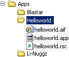

:warning: _This file was converted from the EDGELIB 4.02 documentation from 2012 and is included for historic purposes. The documentation is not maintained anymore: information is outdated and external links might be broken._

# Reading folders

## The folder structure
A typical filesystem contains files and folders. Files are organised in a folder structure, for Symbian it will look like this:



This is an example of the internal filesystem of a Symbian phone with an application installed. Not all files and folders are listed to keep it simple.

## Reading a filename list
It's possible to read a list of filenames from a folder. First a folder is opened, then the filenames are read one by one until there is no more to read, then the folder is closed. The following example reads a list of files from the program folder (current path):

_Code (12 lines)_
```c++
#define MAX_FILELIST 128
 
ClassEFile ef;
char filename[MAX_FILELIST][MAX_EFILESTR];
if (ef.OpenFolder(ecd.dat->currentpath))
{
    unsigned long ctr;
    for (ctr = 0; ctr < MAX_FILELIST; ctr++)
        if (!ef.ReadFolder(filename[ctr]))
            break;
    ef.CloseFolder();
}
```

## Chapters
* [Basic file functions](tutorials_files_basic.md)
* **Reading folders**
* [EDGELIB package](tutorials_files_edgepackages.md)

