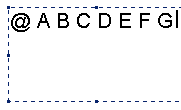

:warning: _This file was converted from the EDGELIB 4.02 documentation from 2012 and is included for historic purposes. The documentation is not maintained anymore: information is outdated and external links might be broken._

# Creating fonts

## The EDGELIB font system
EDGELIB saves its font in images with several rasterized font characters (by default it saves 128 characters). These font characters can have a fixed width (each characters has the same width in pixels) or variable width. When the font is variable width, it will have a white line above each font character, telling EDGELIB the amount of space each characters uses in the image file.

## Preparing a font for the EDGELIB Font tool
The EDGELIB Font tool will take an image with 95 or more font characters (the first 33 aren't used, including space), and checks the image for these characters. After that, it creates a new file with an organized font, one that can be used internally by EDGELIB.

First, let's prepare a source image file. Download the [text file](files/characters.txt) containing the 128 basic font characters or the [extended text file](files/characters2.txt), open it and copy them to the clipboard. Then open a graphic editing program (like Windows Paint or Photoshop) and use the text tool to write these font characters in the image. Take a greedy approach with the spacing between each font character, the EDGELIB Font tool won't be able to recognize the font characters when they are too close to each other. The minimal amount of spacing between each font character can be adjusted in the program with the tolerance option.

## Creating a font image file
After saving this image file, you can use the EDGELIB Font tool to process it. After opening the tool, you'll have a choice if you want a fixed font file, or a variable font file. After making your choice, select "open & process" and select the image file you just created. After a short while, the program is done, and a new file has been written. If everything went correctly, the new font file can be used as an EDGELIB surface by using the font drawing class functions.

## Chapters
* **Creating fonts**
* [Smooth fonts](tutorials_fonttool_smoothfonts.md)

