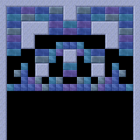
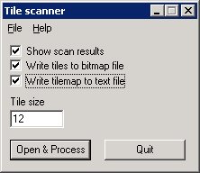

:warning: _This file was converted from the EDGELIB 4.02 documentation from 2012 and is included for historic purposes. The documentation is not maintained anymore: information is outdated and external links might be broken._

# Using the EDGELIB Tile Scanner tool

The EDGELIB Tile Scanner tool is able to scan an image for tiles, find duplicates and write files to implement a tile set in your game. This tool will only be useful if duplicate tiles can be found within the image, otherwise the tile set will be as big as the original image. This tutorial will explain the program and which options are available.

First let's take an image suitable for scanning tiles:

When starting the tile scanner, the following window should appear:

When processing an image file it's possible to count the amount of unique tiles within the image, write the tile set to a bitmap, and write a tilemap to include in C++.

## Writing tile set information
When this option has been enabled, a bitmap file will be written at the same location as the source image file. For example, if the source image was image.bmp then the bitmap file is written as `image_tiled.bmp`. This file will always have 16 columns of tiles, and the number of rows depend on the amount of unique tiles found. A result can be seen below, when scanning the image from this tutorial.

The tile map data will be written to a text file, in this case `image_tilemap.txt`. This file can be opened with a text editor and the content of this file can be copied to a C++ source or header file.

